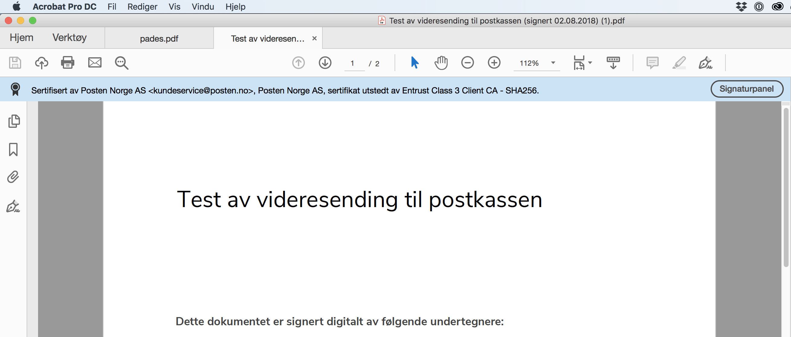
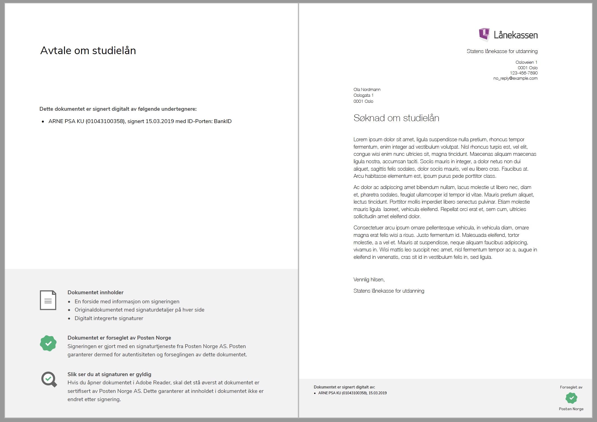

..  _signerte-dokumenter:

Signerte dokumenter
====================
Med en digital signatur kan man signere dokumenter papirløst ved å bruke autentisering av en person og koble det sammen med et dokument. For signerte PDF-dokumenter ligger signaturdata i selve filen, og mange PDF-lesere har mulighet til å vise den digitale signaturen.

Etter at signering av et dokument er fullført får vi en *teknisk signatur* og en *signert PDF*.

En teknisk signatur er en XML-fil som kalles *XML Advanced Electronic Signature (XAdES)*, og er beviset på at du har signert digitalt. XAdES inneholder data som kan verifisere hvem som signerte, tidspunktet for signeringen, hvilken signeringsmetode som ble brukt, hvilken IP-adresse undertegner hadde, og om dokumentet er blitt endret etter signeringstidspunktet.

En signert PDF kalles *PDF Advanced Electronic Signature (PAdES)*. Denne består av originaldokumentet, en forside med informasjon om signeringen, **og** de tekniske signaturene (XAdESene) for alle undertegnerne. XAdESene er digitalt integrerte i PAdES-en og ikke synlige, men man kan åpne filene i signaturpanelet i PDF-leseren. En signert PDF med tre undertegnere, vil altså inneholde originaldokumentet, en forside med informasjon om signeringene, og tre XAdESer som er digitalt integrert i dokumentet.

Alle dokumenter kan lastes ned i en periode etter at signeringsoppdraget er fullført. Levetiden er avhengig av om :ref:`langtidslagring` er aktivert for avsenderen.

..  _identifisereUndertegnere:

Hvordan identifiseres undertegnere i et ferdig signert dokument?
------------------------------------------------------------------

Under opprettelse av signeringsoppdrag kan avsender velge hvordan undertegnerne skal identifiseres i de signerte dokumentene. 
Avsender velger å inkludere én av følgende identifikatorer i signerte dokumenter:

Når avsender er en privat virksomhet:

- Navn + fødselsnummer
- Navn + fødselsdato 

Når avsender er en offentlig virksomhet: 

- Navn + fødselsnummer
- Navn

..  CAUTION::
    Dersom du vil at undertegners fødselsnummer skal fremkomme på det signerte dokumentet er du av personvernmessige hensyn nødt til å adressere undertegner på fødselsnummer i signeringsoppdraget.

Hvis du utelater fødselsnummer i de signerte dokumentene kan vi ikke påvise identiteten med 100% sikkerhet [#fotnotePåviseIdentitet]_. Vi kan likevel i de aller fleste tilfeller oppnå tilstrekkelig beviskraft, på bakgrunn av konteksten signeringen skjer i.

Sannsynligheten er for eksempel svært liten for at 2 personer med navn Kari Olsen signerer en lærekontrakt med Lærlingebedrift AS på eksakt samme tidspunkt. I tillegg vil tekniske spor, og andre eksterne forhold som kunderelasjon eller opplysninger i dokumentet også støtte opp under identiteten til den som har signert.

Det signerte dokumentet
========================

Som vist under vil dokumentet få en forside som viser hvem som har signert og hva dokumentet inneholder. Hver side inneholder også en bunntekst som viser hvem som har signert.

|pades-visning-adobe-innhold|

I produksjonsmiljø
-------------------
Hvis dokumentet er signert i et produksjonsmiljø så kan man verifisere signaturen i f.eks. Adobe Acrobat Reader ved å klikke på *Signaturpanel* i den blå infoboksen.

|pades-visning-adobe-prod|

I et testmiljø
---------------
Hvis dokumentet er signert i et testmiljø så er det teknisk sett ikke en gyldig signatur siden det er sertifikater fra en test-utsteder som brukes. Dette ser du i den blå infoboksen. Det er likevel mulig å se på signaturene slik som i produksjonsmiljøet.

|pades-visning-adobe-test|

Format på signaturen
=====================

Med signaturformat mener vi formatet på objektet som skapes gjennom signeringsprosessen. Det elektronisk signerte dokumentet lagres normalt på et annet dokumentformat enn originaldokumentet som ble signert. Signeringstjenesten støtter følgende signaturformater som er i utbredt bruk i Norge i dag. Dette inkluderer både formatene som støttes direkte av e-ID-leverandørene, i tillegg til formater som tilbys av signeringstjenesten gjennom pakketering.

**SEID-SDO**: SEID-SDO er et påbygg av ETSI (the European Telecommunications Standards Institute) CAdES/XAdES

**LTV-SDO**: Betegnelse for en SDO (Signed Data Object) som er utvidet med data for langtidsvalidering (LTV-data). LTV-SDO er en XAdES.

**PAdES**: PAdES er et signaturformat som inneholder originaldokumentet, alle signaturer og all informasjon som er nødvendig for å validere signaturen. Formatet er spesifisert av ETSI, og bygger på PDF. En PAdES kan åpnes i en vilkårlig PDF-leser. Adobe Reader (og eventuelle andre avanserte PDF lesere) vil også kunne vise frem deler av valideringsinformasjonen slik at sluttbrukeren selv kan se at dokumentet er gyldig signert.

Pakketering av signaturer
===========================

Signeringstjenesten gjør pakketering av signaturer gjennom et format for langtidsvalidering kalt LTV-SDO. LTV-SDO er en XAdES som brukes til å styrke og standardisere signaturene som kommer fra e-ID-leverandørene. Selv om LTV-SDO er et format som er utviklet primært for langtidsvalidering, har det andre egenskaper som gjør at det er ønskelig å bruke det ved ordinær prosessering og oppbevaring av signerte dokumenter. Det gjør at signeringstjenesten og tjenesteyterne har ett format å forholde seg til, uavhengig av hvilken e-ID-leverandør som er brukt til signering og om dokumentet skal langtidsvalideres eller ikke.

Pakketering gjøres i to steg:

#. Pakketering av SDO til LTV-SDO. Her utvides og styrkes signaturen for å legge til rette for langtidsvalidering og å styrke bevisverdien.
#. Pakketering av LTV-SDO til PDF/PAdES. Her legges det til støtte for multisignatur, brukervennlighet og lettere manuell og maskinell prosessering hos mottaker.

Denne pakketeringen gir en rekke fordeler:

1. **Brukervennlighet**: Pakketering til PDF/PAdES lar brukeren se det signerte dokumentet med påført signatur. Det er en viktig del av signaturseremonien at menneskelige brukere får en slik gjenpart.
2. **Multisignatur - flere signatarer**: Pakketering til PDF/PAdES gir mulighet for et samlet dataobjekt for flere signaturer på samme dokument. Den vil også vise frem signaturene på en brukervennlig måte, slik at man kan se flere signaturer på samme dokument.
3. **Multisignatur - flere signerte dokumenter**: Pakketering til PDF/PAdES gjør det mulig å samle flere signerte dokumenter som hører sammen i ett felles dataobjekt.
4. **Felles format for alle e-ID-leverandører**: Pakketering til LTV-SDO eller til PAdES gir et konsistent signaturformat uavhengig av e-ID- leverandørens format.
5. **Dokumentbehandling i saks- og arkivsystemer**: Pakketering til PDF/PAdES tillater viderebehandling i standard dokumentsystemer, fordi en PAdES også er en PDF.
6. **Validering av signatur for sluttbruker**: Pakketering til PAdES vil tillate validering av dokumentet med standard hyllevare (f.eks. Adobe Reader) dersom den signeres (forsegles) med et sertifikat som gjenkjennes av leseren.
7. **Langtidslagring (LTV)**: Pakketering til LTV-SDO eller PAdES gir den beste støtten for langtidsvalidering. :ref:`langtidslagring`, uavhengig av om det er i sentral arkivtjeneste eller hos kunde, krever et format som tillater preservering og oppbevaring av valideringsdata. Den underliggende SDO-en fra e-ID-leverandøren ligger tilgjengelig i LTV-SDO-formatet, og kan enkelt hentes ut av ved behov. Tjenesten kan derfor både tilby kunder den berikede LTV-SDO-en og tilgang til den underliggende SDO-en fra e-ID-leverandøren. Det er derfor ikke en forutsetning at kunden kan forholde seg til LTV-SDO, men snarere en anbefaling som vil gi standardisert tilgang til beriket og integritetsbeskyttet informasjon om signeringsoppdraget.

Pakketering med XAdES og/eller PAdES gir full nytte av standardiseringsarbeidet for preservering som gjøres i regi av EU (XAdES Baseline som er utviklet av EU-initiativet DSS, og som vil bli de foretrukne standardene i XAdES).

..  |pades-visning-adobe-test| image:: images/pades-visning-adobe-test.png
    :alt: Visning av Pades i Adobe med dokument i testmiljø
    :scale: 20%

..  rubric:: Footnotes

..  [#fotnotePåviseIdentitet] Det signerte dokumentet inneholder en anonymisert identifikator som identifiserer undertegneren med 100% sikkerhet hos leverandøren av e-ID, for eksempel hos BankID. Dette krever oppslag hos leverandøren av e-ID og støttes kun ved avansert signatur

