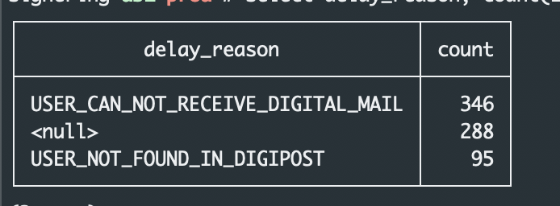

Syntax help
************

This is a cheat-sheet for writing the documentation. It is only for internal use, but feel free to browse if you are curious about how we write our documentation.

All the following examples are for using *reStructuredText* instead of *Markdown*.

Links
======

.. code-block:: bash

   `link text <http://google.com>`_

Will generate the following url:

`link text <http://google.com>`_

Headers
========

.. code-block:: xml

   Innhold restructured text 1
   *****************************

   Innhold restructured text 2
   =============================

   Innhold restructured text 3
   -----------------------------

   Innhold restructured text 4
   ^^^^^^^^^^^^^^^^^^^^^^^^^^^^^

Admonitions
============
`See more about admonitions here <https://learning-readthedocs.readthedocs.io/en/latest/Options/admonition.html>`_

Example admonitions
---------------------

..  code-block:: xml

    ..  CAUTION::
        Caution message
    ..  DANGER::
        Danger zone!
    ..  NOTE::
        Important note!
    ..  TIP::
        Just a tip!

..  CAUTION::
    Caution message
..  DANGER::
    Danger zone!
..  NOTE::
    Important note!
..  TIP::
    Just a tip!

References
============

To reference a chapter *anywhere* in the documentation, add a label over the heading:

..  code-block:: xml

    .. _my-reference-label:

    Section to cross-reference
    --------------------------

    This is the text of the section.

    It refers to the section itself, see :ref:`my-reference-label`.

..  TIP::
    Always use underscore, _, first in the reference, but never when you use the reference.

Tabs
=====

Tabs are used via an extension and how to use can be found `here <https://github.com/djungelorm/sphinx-tabs>`_.

The different tabs are `tab`, `group-tab` and `code-tab`.

.. code-block:: xml

   .. tabs::

      .. tab:: Apples

         Apples are green, or sometimes red.

      .. tab:: Pears

         Pears are green.

.. TIP::
   The different tabs are `tab`, `group-tab` and `code-tab`. With `group-tab`, all examples changes tab at the  same time. `code-tab` is self explanatory, but note that it behaves like `group-tab`.

Example tab
-------------

.. tabs::

   .. tab:: Apples

      Apples are green, or sometimes red.

   .. tab:: Pears

      Pears are green.

   .. tab:: Oranges

      Oranges are orange.

Code snippets
===============

..  code-block:: bash

    ..  code-block:: language

       Some code here ...

Numbered lists
================

..  code-block:: xml

    3. First numbered item starts with three.
    4. The next numbered item, four.
    #. Auto numbering. Will be 5.

Will generate the following list:

3. First numbered item starts with three.
4. The next numbered item, four.
5. Auto numbering. Will be 5.

Footnotes
===========

A footnote can be created:

..  code-block:: xml

    I have something to say [#footnoteWithUniqueName]_.

and used like so:

..  code-block:: xml

    ..  rubric:: Footnotes

    ..  [#footnoteWithUniqueName] Some extra important information!

Example footnote
------------------

I have something to say [#footnoteWithUniqueName]_.

..  rubric:: Footnotes

..  [#footnoteWithUniqueName] Some extra important information!

Images
=======

Images can be added by putting an image in the images-folder and using the following code for an image:

.. code-block:: xml

    ..  |example-image| image:: images/exampledocimage.png
        :alt: alternate text
        :align: right

..  TIP::
    Please add the image reference to the bottom of the file. It makes the file so much easier to read.

Then, just use ``|example-image|`` where you want the image to be inserted.

You can also specify more image tags:

.. code-block:: xml

    :height: 100px
    :width: 200 px
    :scale: 50 %
    :alt: alternate text
    :align: right
